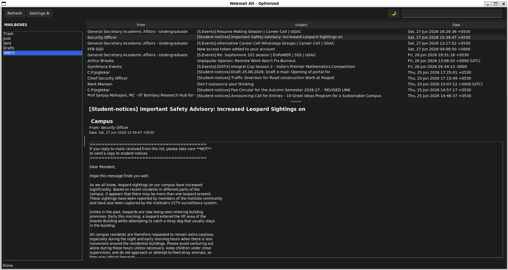

This is just a side project. 

I am build an alternative webmail clone for my university (IITB), for purely personal use. 

I do have some interesting ideas that i want to implement. 
1. Automatic notifications.
2. ML classicification for predicting whether an email is important for me or not. 

Right now the only way to access the client is by cloning this repo, making the venv (uv recommended), pip installing everything needed, and running the app.py

Perhaps, soon ill learn how to professionally package my apps for distribution.

Here is a screenshot of version, say 0.0.1

## 📥 Download

Get the latest Windows executable here:  
[**Download Webmail.exe (v1.2)**](https://github.com/aarav911/webmail-alt-client/releases/download/v1.2/Webmail.exe)

*Requires Windows 10/11. No installation needed.*   

Note: You will need to put in your SSO TOKEN to login. [Get your SSO token following these steps.](https://www.cc.iitb.ac.in/attachments/ssoat/stepToReplacLDAPp-wWithSSOATforEmailClient.pdf)
